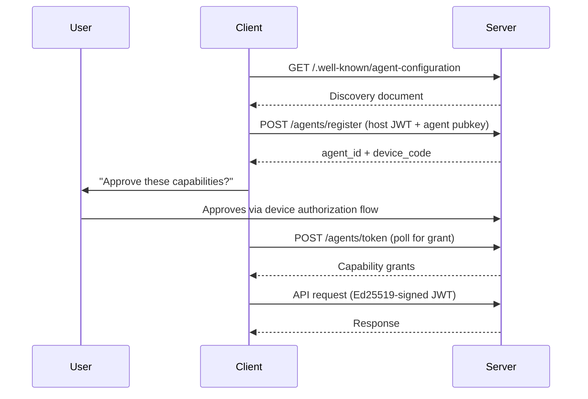

Agent Auth is an open protocol that gives AI agents their own identity. Instead of borrowing a user's OAuth token or sharing a single API key, each agent gets its own cryptographic keypair, its own granted capabilities, and its own lifecycle.

Using Agent Auth, AI applications like Claude, ChatGPT, or Cursor can connect to external services — banks, APIs, deployment pipelines, communication tools — and perform tasks with **clear attribution and scoped permissions**.

## The problem

When an agent acts on behalf of a user, it typically reuses the user's OAuth token or a shared client credential. That collapses the agent into the user's identity:

- **No visibility** — the server can't tell which agent made a request
- **No scoping** — every agent gets the user's full permissions
- **No isolation** — you can't revoke one agent without revoking all of them

For autonomous agents (background workers, scheduled jobs), the problem is worse: there's no identity model at all. The agent is forced to pretend to be a human user just to use a service.

## What Agent Auth does

Agent Auth makes each runtime agent a first-class principal. Instead of borrowing someone else's identity, each agent is registered with its own identity, granted capabilities, and lifecycle. This gives servers something existing auth models are missing: a way to identify which specific agent is acting, what capabilities it holds, and how to manage it independently.

- **Per-agent identity** — every agent gets its own ID and cryptographic keys
- **Scoped capabilities** — agents only get access to the specific actions they need
- **User-controlled approval** — capabilities are approved through a device authorization flow
- **Independent lifecycle** — each agent can be revoked or expired without affecting others
- **Full audit trail** — every action is attributed to a specific agent

## How it works

The core flow is simple:

1. A **client** (e.g. an MCP server, SDK, or CLI) discovers a service via its well-known endpoint
2. The client registers an **agent** with the service's authorization **server**
3. The user approves the agent's requested capabilities
4. The agent authenticates with short-lived Ed25519-signed JWTs on every request

Agent Auth works alongside existing standards — it uses OAuth's device flow for approval, follows DPoP-style proof-of-possession patterns, and is designed to be the auth layer for MCP.

## Learn more

- [Servers — authorization and capability management](/docs/servers)
- [Client — the agent-server bridge](/docs/client)
- [Agents — runtime AI actors](/docs/agents)
- [Build a server — get started with Better Auth](/docs/build-server)
